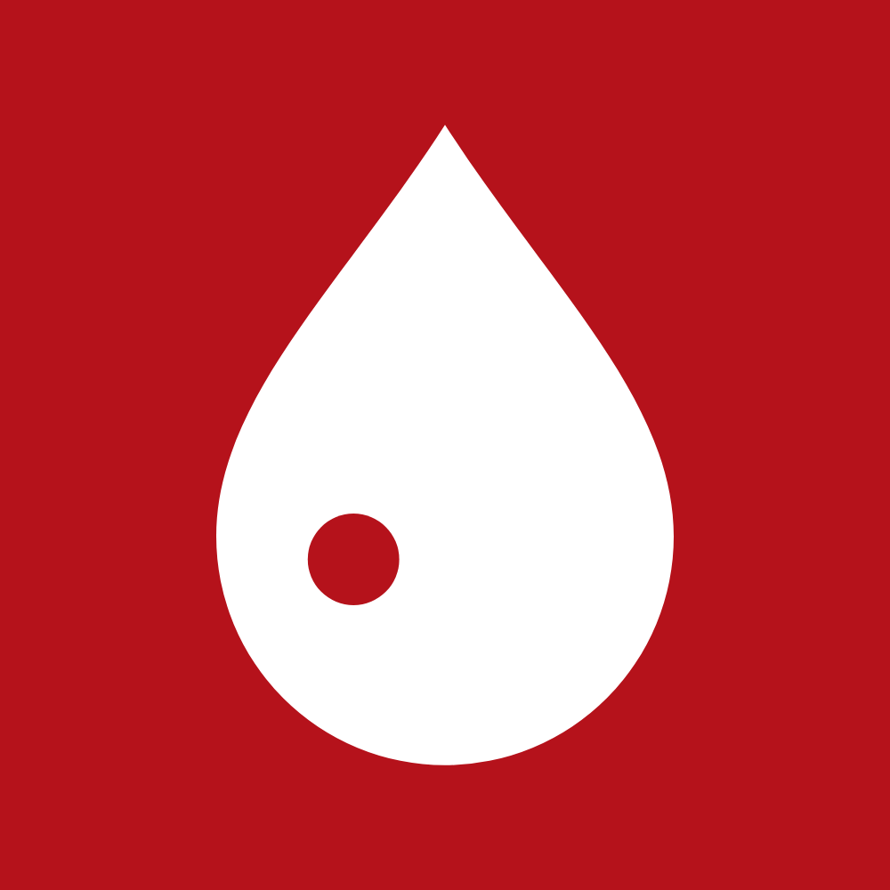
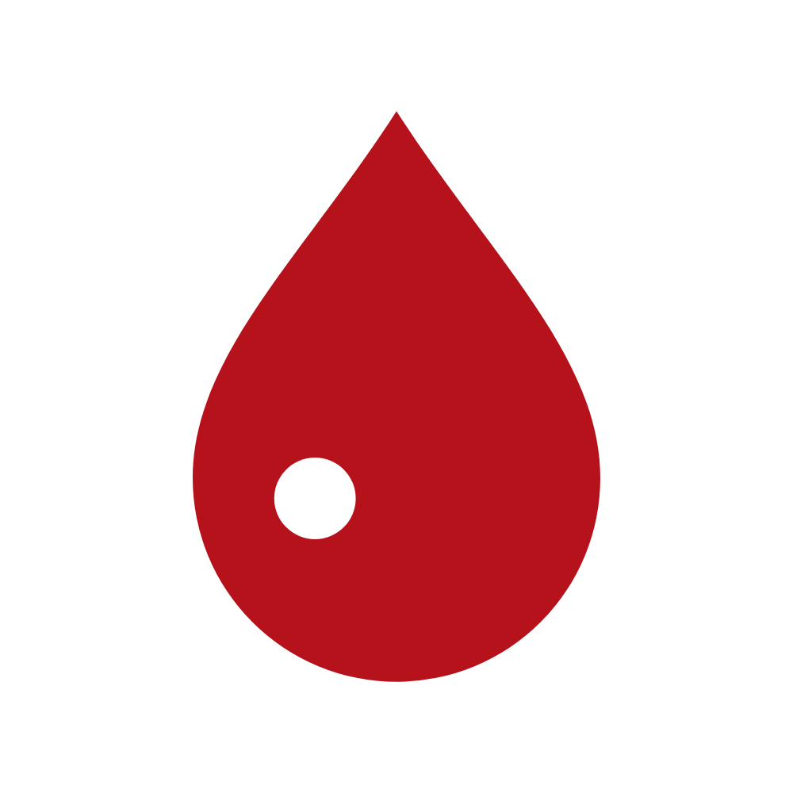
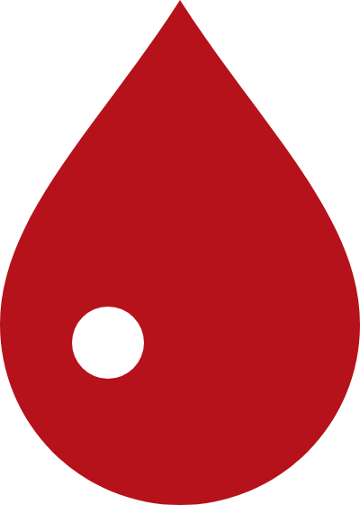
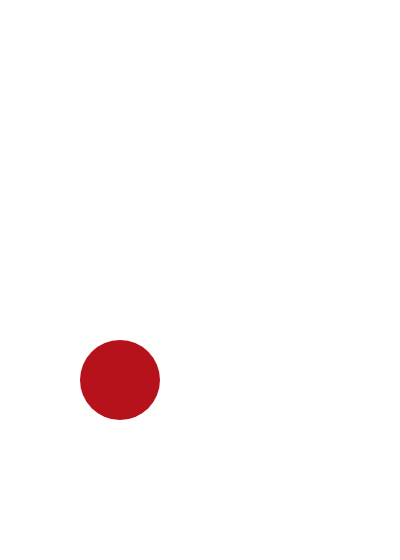
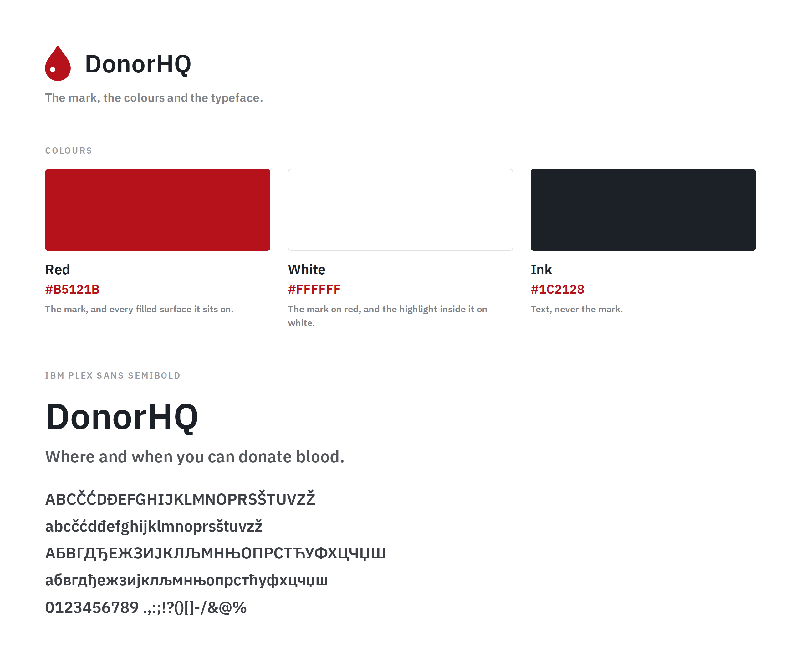

# DonorHQ

The mark, the colours, and the generator that draws every DonorHQ brand.

<picture>
  <source media="(prefers-color-scheme: dark)" srcset="general/assets/banner-white.png">
  
</picture>

A country brand differs from the house brand in exactly one thing: the word it carries. The drop,
the red, the typeface and every measurement are shared, which is the point of a house identity and
the reason this repository holds a generator rather than a folder of files per country. A country
supplies parameters; it does not draw anything itself.

```
marks/                      the logo and the drop, drawn once and shared by every brand
general/tokens.mjs          the colours, the sizes and the drop. Imports nothing
general/generator.mjs       the functions that draw a brand, and the rasteriser
general/make-assets.mjs     the house brand: its banners and its specimen
countries/<country>/        one file per country, holding its word or words
fonts/                      IBM Plex Sans SemiBold, complete, and its licence
```

## Scripts

Run `pnpm install` once, then:

|                                              | Takes                                 | Draws                                        |
| -------------------------------------------- | ------------------------------------- | -------------------------------------------- |
| `pnpm country <country> <word>`              | a folder name and the word to draw    | creates the country and draws it             |
| `pnpm country <country> <script>=<word> ...` | a folder name and a word per alphabet | the same, one set per script                 |
| `pnpm assets:all`                            | nothing                               | the marks, the house brand and every country |
| `pnpm assets:marks`                          | nothing                               | the shared logo and drop only                |
| `pnpm assets:general`                        | nothing                               | the house brand only                         |
| `pnpm assets:<country>`                      | nothing                               | that country only                            |
| `pnpm test`                                  | nothing                               | runs the tests                               |
| `pnpm lint`                                  | nothing                               | oxlint                                       |
| `pnpm format`                                | nothing                               | prettier, in place                           |

`pnpm country` with nothing after it asks for what it needs, so there is no need to come back here
for it. It only asks when someone is there to answer: without a terminal it prints the usage and
exits, rather than hanging on a question nobody will see.

`assets:general` draws the brand in `general/`, not all of them. That is what `assets:all` is for:
`general` is a folder name here, and an earlier bare `assets` sitting beside it read as though one
were a subset of the other.

`assets:all` finds countries rather than reading a list, so adding one is adding a folder. A list
would be a second place to remember, and forgetting it would fail silently by never drawing the
new brand. The per-country scripts are a convenience and nothing depends on them.

Playwright is the only dependency the drawings need, and it is there to rasterise. oxlint and
prettier are the other two, and nothing calls them but you.

## The set

**Four files are shared by every brand and three belong to each one.** The split is not tidiness:
the logo and the bare marks have never seen a word, so they are identical in the house brand and in
every country, and three copies of a file that cannot differ are three chances for them to differ
anyway.

<table>
  <tr>
    <td align="center"></td>
    <td align="center"></td>
    <td align="center"></td>
    <td align="center"></td>
  </tr>
  <tr>
    <td align="center"><code>logo-red</code></td>
    <td align="center"><code>logo-white</code></td>
    <td align="center"><code>mark-red</code></td>
    <td align="center"><code>mark-white</code></td>
  </tr>
</table>

| In `marks/`, shared | Use it on                                                       |
| ------------------- | --------------------------------------------------------------- |
| `logo-red.png`      | anything. This is the logo, and what an avatar is uploaded from |
| `logo-white.png`    | surfaces that are already red                                   |
| `mark-red.png`      | light backgrounds, where the drop stands alone                  |
| `mark-white.png`    | dark backgrounds, or red ones                                   |

| Per brand          | Use it on                          |
| ------------------ | ---------------------------------- |
| `banner-red.png`   | the top of a light page            |
| `banner-white.png` | the top of a dark page             |
| `card-red.png`     | the picture under a shared link    |
| `card-white.png`   | the same, where red would clash    |
| `specimen.png`     | showing what that brand is made of |

Every name follows one rule: **the suffix is the colour the file is mostly made of.** So
`mark-red` is a red drop and `logo-red` is a red tile with a white drop on it. Naming them for the
background instead reads well until it does not: a red tile is happy on a light page and on a dark
one, so `logo-light` would be a lie half the time.

Everything is PNG, and only PNG. The banners could not be anything else: putting the word back
into SVG means either live text in whatever typeface the reader happens to have, or outlines that
stop answering to the string that produced them. The rest follow the banners rather than splitting
the set across two formats that would then have to be kept in step.

The two bare marks carry no background and no padding, which leaves the spacing to whatever places
them.

The banners come as a pair because a reader's theme decides what sits behind them, and a banner
has to contrast with the page rather than with itself. A `<picture>` element picks between them,
which is the only way a static image follows a theme:

```html
<picture>
  <source media="(prefers-color-scheme: dark)" srcset=".../banner-white.png" />
  
</picture>
```

Address them absolutely when the page is an organisation profile. GitHub renders that page
outside the repository it lives in, and only some clients rewrite a relative path back: the
website does, the mobile app does not.

## Specimen



Every brand gets one, drawn with the rest of its set, so it cannot fall out of step with the
values below. They differ in exactly the way the brands do: the word. The palette and the
alphabets are identical on all of them, which is the point rather than a duplication - a sheet
that showed a country its own colours would be describing a different identity.

Both alphabets are on every one of them deliberately. The font's Cyrillic coverage is the one
thing that has gone wrong here, and thirty letters on a page are worth more than a sentence
claiming they exist.

It is the only drawing whose height follows its content rather than a fixed box.

## Colours

The three, and the only three. A country does not get its own, because a house identity that
changes colour per country is not one identity.

|       |           |                                                       |
| ----- | --------- | ----------------------------------------------------- |
| Red   | `#B5121B` | the mark, and every filled surface it sits on         |
| White | `#FFFFFF` | the mark on red, and the highlight inside it on white |
| Ink   | `#1C2128` | text, never the mark                                  |

## The wordmark

**The word is live text, drawn with the real typeface, and rasterised.** That ordering is the
whole design, and it is why the output is PNG rather than SVG.

An SVG loaded through an `` tag cannot fetch a webfont, and IBM Plex Sans is installed on
nobody's machine by default. So shipping SVG leaves two options, and both are bad: a wordmark set
in live text renders as Segoe UI on Windows, Roboto on Android and DejaVu on Linux, and a wordmark
frozen into glyph outlines no longer has any connection to the word that produced it. The second
one is worse than it sounds. It means the string in a brand's file is decorative: change it, and
nothing at all happens to the pictures.

Rasterising here, with the typeface loaded from `fonts/`, makes the string authoritative. Change
`TEXT` and the pictures change.

It also made the layout exact. The banner is laid out in HTML, because SVG has no layout: centring
a mark and a word beside each other in SVG needs the word's width, which SVG cannot measure, so it
used to be estimated from per-glyph averages. Flexbox does it properly and for nothing.

The typeface is **IBM Plex Sans SemiBold**, under the SIL Open Font License, which is in
`fonts/OFL.txt` beside it.

## Rules

The mark is one path with one highlight. The highlight is what stops a drop reading as a leaf, so
it is never dropped, and it is always the colour of whatever the drop sits on.

Do not recolour it, outline it, add a gradient or a shadow to it, rotate it, or set it against a
photograph. If it needs to sit on something busy, use the filled tile.

The drop is taller than it is wide and is not centred inside its own box: the drawn shape runs
from x 12 to x 52 and from y 4 to y 60 in a 64 unit square. Anything that centres the box rather
than the shape puts it low and to the right.

## Adding a country

```bash
pnpm country serbia Davalac
pnpm country serbia cyrl=Давалац lat=Davalac
```

That makes the folder, writes the script, adds an `assets:<country>` entry, and draws the assets.
The first form produces one set; the second produces one per script, each in its own folder, for a
country written in more than one alphabet.

It refuses rather than overwrites, and it checks the typeface can draw the word **before** it
creates anything, so a country is never left half-made:

```
the typeface has no glyph for "日", "本", so "日本" would be drawn as empty boxes
countries/serbia already exists. Edit it, or remove it first
"Crna Gora" is not a folder name: lower case, digits and hyphens, starting with a letter
```

Adding one by hand is also fine. A country is one file holding a string:

```js
const written = await writeSet({ text: "Davalac", out: join(import.meta.dirname, "assets") });
```

Everything else comes from the generator, which is why a country cannot ship a different red or a
differently sized logo by accident.

## Tests

```bash
pnpm test
```

Node's own runner, so there is no test framework to install. They cover the one piece here with
real logic rather than geometry: the character map parser that `writeSet` trusts before it draws
anything. What a drawing looks like is settled by looking at it, and no assertion replaces that.

Two of them build synthetic fonts. Every font this repository has ever used carries only a format
4 character map, so the format 12 branch of the parser would never have run against a real file
and could have been wrong for years. Those tests are the only thing that has ever executed it.

## Why the glyph check exists

A missing glyph is not an error anywhere in this pipeline. The browser draws the typeface's empty
box, the screenshot succeeds, and a brand that looks finished is a row of rectangles.

That already happened once here. The TTF that Google Fonts serves through its older API is a Latin
subset, 270 glyphs and no Cyrillic, so `Давалац` came out as seven boxes with nothing reported. The
font committed in `fonts/` is now the complete IBM Plex Sans SemiBold from IBM, 1019 glyphs, and
`writeSet` reads the font's character map and refuses a word it cannot draw. A browser cannot be
asked this question: it answers yes to everything, because it falls back rather than fails.

## Licence

Three things here are licensed differently, and the split is deliberate.

**The code is MIT**, in `LICENSE`. The generator, the glyph check and the scripts are ordinary
engineering and there is no reason to keep them to ourselves.

**The marks are not.** The drop, the name DonorHQ, the wordmarks and everything drawn from them,
including every image under `general/assets` and `countries/`, remain all rights reserved. A mark
exists to mean one thing, and a licence letting anyone use it for their own project is a licence
to make it mean nothing. The images are covered by this half even though a script produced them.

**The typeface is IBM Plex Sans**, under the SIL Open Font License, which is in `fonts/OFL.txt`
beside it, unmodified as that licence requires. It is redistributed here rather than fetched so a
render depends on nothing. Images produced with a font are not covered by the OFL, so the drawings
carry no obligation from it.
